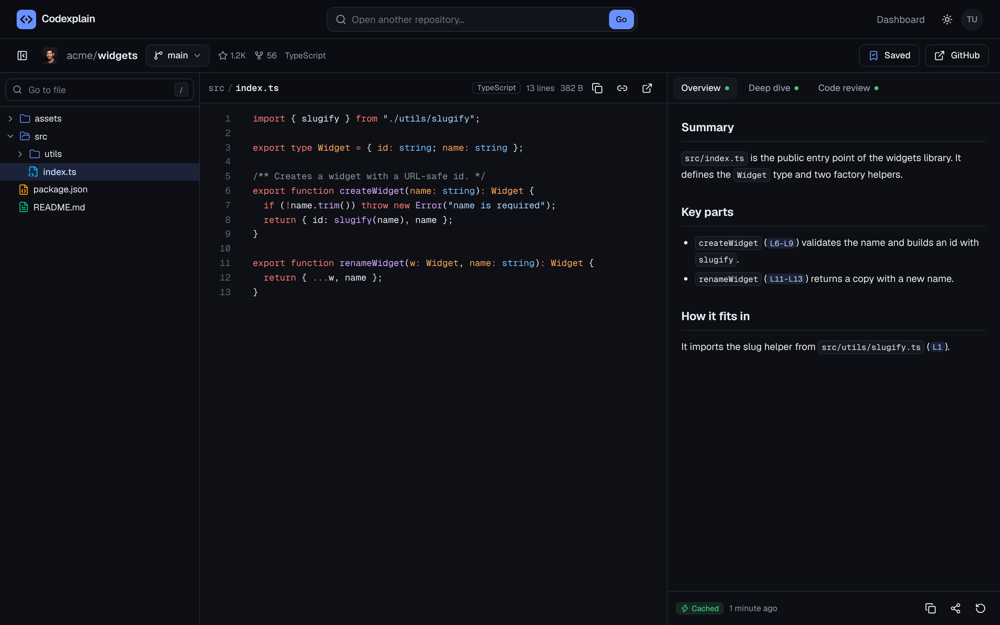
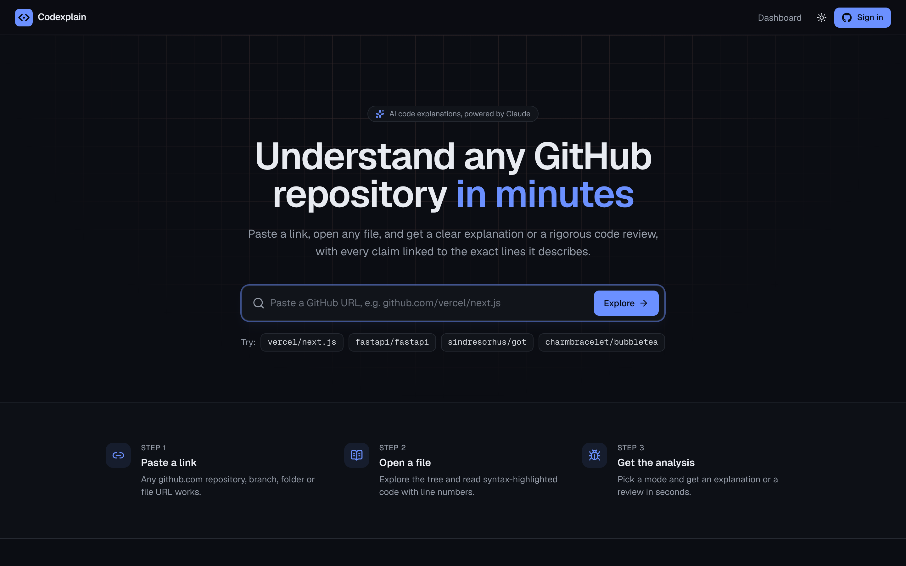
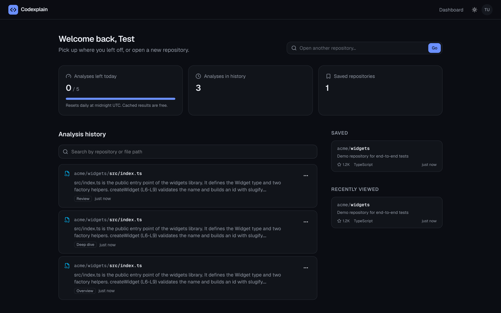

# Codexplain

**Understand any GitHub repository in minutes.** Paste a repo link, browse its files, open one, and get a clear explanation, a deep dive, or a code review from Claude. Every claim links back to the exact lines it describes.



## Features

- **Paste anything GitHub.** `owner/repo`, full URLs, `.git` clone URLs, branch/folder/file links, and `#L12-L30` line anchors all resolve to the right place.
- **Fast repository browser.** Fuzzy file finder (`/`), keyboard tree navigation, branch and tag switcher, Shiki syntax highlighting, shareable line selections (shift-click for ranges).
- **Three analysis modes.**
  - *Overview* explains what the file does and how it fits the repo.
  - *Deep dive* walks through the control flow, data and edge cases.
  - *Code review* lists bugs, security issues and maintainability problems by severity.
- **Streaming with live line links.** Answers stream token by token. Every `L12` or `L12-L30` reference jumps to and highlights those lines in the code.
- **Smart caching.** Results are keyed by file content SHA and mode. Re-opening an unchanged file is instant and doesn't count against your quota.
- **Dashboard.** Searchable analysis history, saved and recently viewed repositories, and daily usage.
- **Public share links.** You can share any analysis as a read-only page and revoke the link at any time.
- **Polished UX.** Dark and light themes, responsive mobile layout, skeleton loading states, and friendly error pages for private, missing or rate-limited repositories.

| Landing | Dashboard |
| --- | --- |
|  |  |

## Security

| Area | What Codexplain does |
| --- | --- |
| Authentication | GitHub OAuth through NextAuth with read-only scopes (`read:user user:email`). The GitHub access token is **never stored in the database**. It lives only in the encrypted, HTTP-only session cookie. |
| Input validation | Zod schemas check every owner, repo, ref and path. Path traversal and malformed refs are rejected with a 400. |
| CSRF | State-changing endpoints require a same-origin `Origin` header. |
| Abuse limits | Per-IP and per-user rate limits apply. A daily analysis quota is enforced atomically in Postgres, and the quota is refunded when an analysis fails. |
| Prompt injection | File contents are passed to Claude as clearly delimited untrusted data, and the system prompt tells the model never to follow instructions found inside them. |
| Output rendering | Markdown renders without raw HTML, so model output can't inject scripts. |
| Headers | The app sends a strict Content-Security-Policy, `X-Frame-Options: DENY`, `nosniff` and a referrer policy. In production it also sends HSTS and `upgrade-insecure-requests`. |
| Privacy | Only public repositories are supported. Share links use 128-bit random slugs, and shared pages are `noindex`. |

## Architecture

```
Browser ──► Next.js App Router (React Server Components + route handlers)
              │
              ├─ /api/github/*   ─► GitHub REST API (repo, refs, tree, file), cached with revalidate
              ├─ /api/analyze    ─► Claude API (streaming) ─► NDJSON stream to the browser
              ├─ /api/analyses   ─► history, share/revoke
              └─ Prisma ─► Postgres (users, repositories, cached analyses, views, usage)
```

How an analysis request flows through `/api/analyze`:

1. The server checks the origin, session, rate limit and request body.
2. It re-fetches the file from GitHub. It never trusts file content sent by the client.
3. On a cache hit (same repository, path, file SHA and mode), it returns the stored analysis immediately.
4. Otherwise it reserves one unit of quota with a single conditional `INSERT … ON CONFLICT … WHERE count < limit`.
5. It streams the analysis from Claude, sending a cached system prompt plus the line-numbered file and a relevant slice of the repository tree. It forwards `delta` events to the browser as NDJSON.
6. It saves the result and records it in the user's history. On error or client abort, it refunds the quota.

**Tech:**

- Next.js 16, React 19, TypeScript and Tailwind CSS v4, with Radix primitives
- NextAuth (GitHub) and Prisma on Postgres
- Anthropic TypeScript SDK and Shiki
- Tests with Vitest and Playwright

## Running locally

Requires Node 20.9+ and Postgres.

```bash
git clone https://github.com/Arnavsharma2005/codexplain.git
cd codexplain
npm install
cp .env.example .env      # then fill in the values below
npm run db:migrate
npm run dev               # http://localhost:3000
```

1. **GitHub OAuth app.** Go to GitHub, then Settings, Developer settings, OAuth Apps, and choose New OAuth App.
   - Homepage URL: `http://localhost:3000`
   - Authorization callback URL: `http://localhost:3000/api/auth/callback/github`
   - Copy the client ID and a client secret into `GITHUB_ID` and `GITHUB_SECRET`.
2. **Claude API key.** Create one at [console.anthropic.com](https://console.anthropic.com) and set `ANTHROPIC_API_KEY`.
3. **Session secret.** Run `openssl rand -base64 32` and put the result in `NEXTAUTH_SECRET`.

## Tests

```bash
npm run lint && npm run typecheck
npm test            # unit tests (URL parsing, validation, line refs, prompts, tree utils)
npm run test:e2e    # Playwright, desktop + mobile
```

The end-to-end suite runs the production build against a local mock of the GitHub and Claude APIs (`tests/e2e/mock-server.mjs`) and a `codexplain_test` database. It needs no real credentials. It covers:

- deep links
- tree filtering
- binary files
- error pages
- security headers and API hardening
- streaming analysis with line links
- cache hits
- history and share/revoke
- saved repositories
- quota enforcement
- the mobile layout

CI runs everything on each push and pull request (`.github/workflows/ci.yml`).

## Deploying (Vercel + Neon)

1. Create a Postgres database on [Neon](https://neon.tech). Use the pooled connection string as `DATABASE_URL` and the direct one as `DIRECT_URL`.
2. Import the repository into [Vercel](https://vercel.com). The `vercel-build` script applies migrations, then builds.
3. Set the environment variables from `.env.example` for the Production environment.
   - Set `NEXTAUTH_URL` to your https domain.
   - `NEXTAUTH_URL` is also read at build time to enable HSTS.
4. Create a second GitHub OAuth app (or update the first one) with your production callback URL.

## License

MIT
